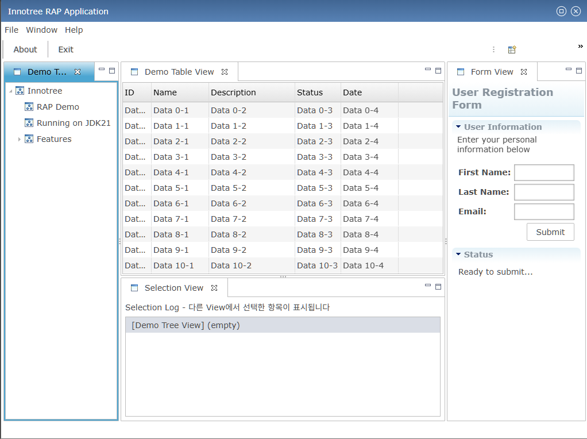

# Study Eclipse RAP

Eclipse RAP(Remote Application Platform)를 학습하기 위한 프로젝트입니다.

## 프로젝트 구조

```
├── com.innotree.rap.demo/     # Innotree RAP 데모 프로젝트
│   ├── src/                   # Java 소스 코드
│   ├── META-INF/              # OSGi 번들 설정
│   ├── launch/                # Eclipse 실행 설정
│   └── plugin.xml             # 플러그인 확장점 정의
└── org.eclipse.rap.demo/      # Eclipse RAP 공식 데모 (참고용)
```

## 개발 환경

- **IDE**: Eclipse RCP 2025-12
- **Java**: JDK 21
- **RAP**: 4.5.0

## 실행 방법

### 1. 프로젝트 임포트

1. Eclipse 실행
2. `File` → `Import` → `General` → `Existing Projects into Workspace`
3. `com.innotree.rap.demo` 폴더 선택 후 `Finish`

### 2. Target Platform 설정

1. `Window` → `Preferences` → `Plug-in Development` → `Target Platform`
2. RAP Target Platform 설정 (RAP 4.5.0 런타임 포함 필요)

### 3. 애플리케이션 실행

1. `com.innotree.rap.demo` 프로젝트 우클릭
2. `Run As` → `RAP Application` 선택
   - 또는 `launch/Innotree RAP Demo.launch` 파일 우클릭 → `Run As` → `Innotree RAP Demo`
3. 브라우저에서 자동으로 `http://localhost:<port>/innotree/` 접속

### 4. 접속 URL

```
http://localhost:8080/innotree/
```

## 주요 구성 요소

| 클래스 | 설명 |
|--------|------|
| `DemoWorkbench` | EntryPoint - RAP 애플리케이션 진입점 |
| `DemoWorkbenchAdvisor` | Workbench 설정 |
| `DemoWorkbenchWindowAdvisor` | Window 설정 (타이틀, 크기 등) |
| `DemoActionBarAdvisor` | 메뉴/툴바 구성 |
| `DemoPerspective` | 뷰 레이아웃 정의 |

### Views

| View | 설명 |
|------|------|
| `DemoTreeView` | 트리 구조 데이터 표시 |
| `DemoTableView` | 테이블 형태 데이터 표시 |
| `DemoFormView` | 사용자 입력 폼 |
| `DemoSelectionView` | 다른 View에서 선택한 항목 표시 |

## 스크린샷



## 참고 자료

- [Eclipse RAP 공식 문서](https://www.eclipse.org/rap/)
- [RAP Developer's Guide](https://www.eclipse.org/rap/developers-guide/)
